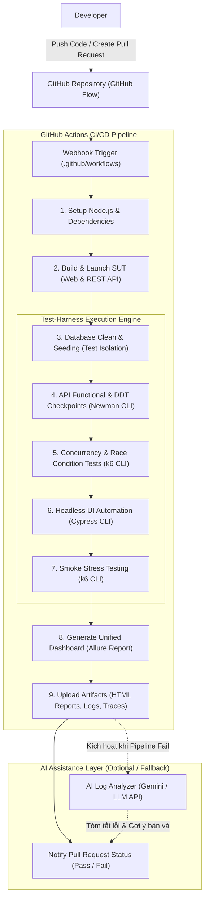

# 📑 ĐỀ XUẤT DỰ ÁN SEMINAR: CI/CD - TEST-HARNESS ENGINEERING
## (FINAL PROJECT PROPOSAL)

**Môn học:** Kiểm thử phần mềm (Software Testing) – FIT@HCMUS  
**Chủ đề:** Xây dựng Hệ thống Kiểm thử Tự động (Test-Harness) Tích hợp Pipeline CI/CD  
**Tài liệu tham chiếu liên quan:**
- [overview.md](./overview.md) | [proposal.md](./proposal.md)
- Báo cáo nghiên cứu thành viên: [Person A](./PersonA/Week3_report.md) | [Person B](./PersonB/23120170_report.md) | [Person C](./PersonC/member_report_C_week3.md) | [Person D](./PersonD/Week3_report.md) | [Person E](./PersonE/member_report_E_week3.md)

---

## 1. Tổng quan & Mục tiêu Dự án

Trong phát triển phần mềm hiện đại, việc tích hợp kiểm thử tự động vào chu trình triển khai liên tục đóng vai trò sống còn nhằm phát hiện lỗi sớm (*Shift-left testing*), rút ngắn chu kỳ phát hành và đảm bảo độ ổn định của hệ thống.

### 1.1. Mục tiêu cốt lõi
1. **Chuẩn hóa nền tảng lý thuyết:** Làm rõ ranh giới và mối quan hệ giữa **CI/CD** và **Test-Harness**, diễn giải các khái niệm chuyên môn theo cách trực quan, dễ tiếp cận cho sinh viên trong lớp.
2. **Xây dựng hệ thống Test-Harness toàn diện (Test Pyramid):**
   - **UI Automation:** Hiện thực hóa tính năng *Record & Playback* và kịch bản tương tác người dùng chạy ở chế độ *Headless*.
   - **API & Data-driven Testing:** Kiểm thử tầng dịch vụ RESTful API, phân tách dữ liệu kiểm thử (JSON/CSV) khỏi kịch bản kiểm thử, kiểm định 5 nhóm *Checkpoints* thiết yếu.
   - **Non-functional Testing:** Kiểm thử tương tranh (*Concurrent Testing*) nhằm phát hiện *Race Condition* và kiểm thử áp lực nhẹ (*Smoke Stress Testing*).
3. **Tự động hóa 100% trên CI/CD Pipeline:** Tự động build, nạp dữ liệu sạch (Database Seeding), cô lập môi trường (Test Isolation), thực thi kịch bản kiểm thử và xuất bản báo cáo trực quan (*Allure Report*).
4. **Tích hợp Trí tuệ Nhân tạo (AI):** Khai thác AI trong việc sinh dữ liệu kiểm thử biên (*Edge-case Generation*), hỗ trợ phân tích log lỗi tự động (*AI Log Analyzer*) khi pipeline thất bại.
5. **Thiết kế bài tập thực hành lớp học (Hands-on):** Xây dựng các kịch bản thực nghiệm gọn nhẹ kèm gợi ý (*hints*) để cả lớp có thể fork repository và chạy thử nghiệm trực tiếp trên GitHub Actions.

---

## 2. Cơ sở Lý thuyết & Kết quả Khảo sát Chuyên môn

### 2.1. Phân biệt CI, Continuous Delivery và Continuous Deployment
Quy trình tự động hóa mã nguồn được nâng cấp theo 3 cấp độ kế thừa:

```
[Continuous Integration (CI)] ──> [Continuous Delivery] ──> [Continuous Deployment]
        Build & Test                   Sẵn sàng phát hành          Tự động đẩy lên Production
   (Phát hiện lỗi sớm)             (Con người phê duyệt)           (Hoàn toàn tự động)
```

- **Continuous Integration (CI):** Tự động build và chạy kiểm thử (Unit, Integration, API) ngay khi lập trình viên tích hợp mã nguồn mới vào nhánh chung nhằm phát hiện sớm xung đột và lỗi cú pháp/logic.
- **Continuous Delivery (CD):** Kế thừa toàn bộ quá trình CI, tự động đóng gói ứng dụng và triển khai lên môi trường Staging/UAT để sẵn sàng phát hành. Quyết định đẩy lên môi trường Production thực tế vẫn thuộc về con người (*Manual Approval Gate*).
- **Continuous Deployment:** Đưa mức độ tự động hóa lên mức cao nhất; nếu mọi bài kiểm thử trên pipeline đều vượt qua (Pass), bản cập nhật sẽ được hệ thống tự động triển khai thẳng lên môi trường Production mà không cần phê duyệt thủ công.

### 2.2. Bản chất và 5 Thành phần Cốt lõi của Test-Harness
**Test-Harness (Bộ khung kiểm thử)** là một môi trường phần mềm có kiểm soát bao gồm các công cụ, dữ liệu và đoạn mã hỗ trợ thực thi tự động các ca kiểm thử và đo lường kết quả. Test-Harness đóng vai trò là động cơ thực thi kiểm thử được gọi bởi CI/CD pipeline.

Hệ thống bao gồm 5 thành phần cấu thành:
1. **Test Scripts:** Tập hợp các đoạn mã hoặc kịch bản tự động mô tả chuỗi thao tác, dữ liệu nạp vào và điều kiện xác định Pass/Fail.
2. **Test Data:** Bộ dữ liệu kiểm thử đầu vào (hợp lệ, biên, lỗi định dạng) được quản lý độc lập.
3. **Drivers:** Thành phần điều khiển gọi trực tiếp vào module đang được kiểm thử khi module cấp cao hơn chưa được phát triển.
4. **Stubs / Mocks:** Module giả lập trả về kết quả định sẵn để thay thế các phụ thuộc bên ngoài chưa hoàn thiện (như cổng thanh toán, dịch vụ gửi mail).
5. **Test Tools:** Các công cụ thực thi kiểm thử, thu thập log, đo lường thời gian đáp ứng và tạo báo cáo trực quan.

### 2.3. Các Tầng Kiểm thử Thực nghiệm trong Dự án

#### a) Kiểm thử Giao diện (UI Automation & Record/Playback)
- **Record & Playback:** Phương pháp ghi nhận lại các thao tác chuột, bàn phím của người kiểm thử trên giao diện web thành mã kịch bản, sau đó phát lại tự động để kiểm tra hồi quy mà không cần lập trình thủ công từ đầu.
- **Chế độ Headless (Headless Mode):** Kỹ thuật chạy trình duyệt ẩn không cần giao diện đồ họa. Đây là yêu cầu tiên quyết khi chạy UI test trên các máy chủ CI/CD (như Linux Runner) vốn không có màn hình hiển thị, giúp tiết kiệm tài nguyên CPU/RAM và tăng tốc độ kiểm thử.
- **Cơ chế định vị (Locators):** Sử dụng các thuộc tính DOM (`data-cy`, `id`, `css selector`, `xpath`) để định vị các phần tử giao diện một cách ổn định, giảm thiểu lỗi kịch bản khi cấu trúc HTML thay đổi.

#### b) Kiểm thử Dịch vụ API & Kiểm thử Hướng dữ liệu (Data-driven Testing)
- **Kiểm thử API ở tầng Service:** Kiểm tra trực tiếp giao thức truyền thông HTTP/HTTPS, kiểm định logic nghiệp vụ, cơ chế phân quyền RBAC và xác thực không trạng thái (JWT). Tốc độ kiểm thử API nhanh hơn gấp nhiều lần so với UI test, rất phù hợp làm chốt chặn bảo vệ đầu tiên trong pipeline.
- **5 Loại Checkpoints (Điểm kiểm định) bắt buộc:**
  1. *Status Code Checkpoint:* Kiểm tra mã phản hồi HTTP (`200 OK`, `201 Created`, `400 Bad Request`, `401 Unauthorized`, `403 Forbidden`).
  2. *Response Time Checkpoint:* Đo lường thời gian phản hồi của endpoint (ngưỡng chấp nhận $< 500\text{ms}$).
  3. *JSON Schema / Contract Checkpoint:* Khóa cứng cấu trúc trường dữ liệu, kiểu dữ liệu trả về để bảo vệ tính tương thích với Frontend.
  4. *Field Values Checkpoint:* So khớp dữ liệu trả về (token không rỗng, số lượng kho trừ đúng, mã đơn hàng chính xác).
  5. *Security Headers Checkpoint:* Kiểm định các header bảo mật và `Content-Type: application/json`.
- **Data-driven Testing (DDT):** Phân tách tuyệt đối giữa kịch bản kiểm thử và dữ liệu kiểm thử. Test Runner nạp tuần tự các dòng dữ liệu từ file ngoài (JSON/CSV) để lặp lại một kịch bản với nhiều trường hợp (dữ liệu hợp lệ, thiếu trường, email sai định dạng, mật khẩu yếu).

#### c) Kiểm thử Phi chức năng: Tương tranh & Áp lực (Concurrency & Stress Testing)
- **Kiểm thử Tương tranh (Concurrent Testing):** Mô phỏng kịch bản nhiều người dùng ảo cùng lúc gửi request thao tác vào một tài nguyên duy nhất tại cùng một mili-giây (ví dụ: kho chỉ còn 1 sản phẩm cuối cùng, 2 người cùng bấm đặt mua). Mục tiêu là phát hiện sớm lỗi **Race Condition (Tranh chấp dữ liệu)** hoặc **Deadlock**.
- **Kiểm thử Áp lực (Smoke Stress Testing):** Đẩy tải nhẹ (50-100 virtual users trong 10-15s) ngay trên pipeline CI/CD để phát hiện hiện tượng nghẽn cổ chai (bottleneck) hoặc rò rỉ bộ nhớ trước khi triển khai.

### 2.4. Nguyên lý Cô lập Kiểm thử & Nạp Dữ liệu Mẫu (Test Isolation & DB Seeding)
Một vấn đề lớn khi chạy kiểm thử tự động lặp lại trên CI/CD là sự phụ thuộc trạng thái dữ liệu (Data Pollution / State Mutation). Nếu một ca kiểm thử tạo tài khoản hoặc sửa đơn hàng trong database, lần chạy pipeline tiếp theo sẽ bị fail do trùng dữ liệu (`UNIQUE constraint`). 
Do đó, hệ thống bắt buộc phải tích hợp bước **Database Clean & Seeding (Idempotency)**: Trước mỗi lần pipeline chạy test, hệ thống tự động copy một bản cơ sở dữ liệu mẫu sạch để đảm bảo mọi bài kiểm thử luôn bắt đầu từ một trạng thái hoàn toàn đồng nhất.

---

## 3. Đánh giá & Lựa chọn Công nghệ (Tech Stack Decisions)

Dựa trên khảo sát so sánh đa chiều về tính khả thi, chi phí vận hành và mức độ thân thiện với môi trường lớp học, nhóm thống nhất lựa chọn hệ thống công nghệ sau:

| Khía cạnh | Các công cụ đã so sánh | Công nghệ được chọn | Lý do chốt lựa chọn |
| :--- | :--- | :--- | :--- |
| **Nền tảng CI/CD** | GitHub Actions, GitLab CI, Jenkins | **GitHub Actions** | Tích hợp gốc với GitHub Repository của nhóm; không tốn chi phí dựng và bảo trì máy chủ như Jenkins; runner đám mây sẵn sàng; chợ GitHub Marketplace đa dạng; thuận tiện cho sinh viên cả lớp fork về chạy bài tập mà không cần cài đặt hạ tầng phức tạp. |
| **Hệ thống Quản lý Dự án** | Jira, Trello, GitHub Projects | **Jira Software** | Chuẩn hóa quy trình Scrum/Kanban, quản lý mã Task chặt chẽ, dễ dàng liên kết commit trên Git với mã công việc Jira làm minh chứng đóng góp. |
| **Ứng dụng Kiểm thử (SUT)** | RealWorld (Conduit), OWASP Juice Shop, eShop App | **eShop / RealWorld Application** | Có kiến trúc gọn nhẹ, bao gồm trọn vẹn cả giao diện Web (React/HTML5) và Backend RESTful API (Node.js/Express, SQLite), dễ chạy cục bộ và chạy trong container, hỗ trợ xác thực JWT và có kịch bản nghiệp vụ thực tế (Giỏ hàng, Đơn hàng). |
| **UI Automation** | Cypress, Katalon Studio, Selenium | **Cypress** (+ Cypress Studio) | Hoàn toàn miễn phí, hỗ trợ chạy dòng lệnh không đầu (`cypress run --headless`) cực kỳ mượt mà trên Linux runner; tính năng Cypress Studio hỗ trợ Record & Playback trực quan; dễ dàng debug và ghi hình video quá trình test khi bị lỗi. |
| **API & Data-driven** | Postman/Newman, JMeter, RestAssured | **Postman + Newman CLI** | Thiết kế kịch bản API trực quan trên Postman Desktop, hỗ trợ viết Checkpoints bằng cú pháp ChaiJS, tự động quản lý biến môi trường JWT Token; công cụ **Newman CLI** cho phép chạy toàn bộ collection và nạp file CSV/JSON trên CI/CD với 1 dòng lệnh duy nhất. |
| **Concurrent & Stress Test**| k6, JMeter, Locust | **k6 CLI** | Viết kịch bản bằng JavaScript, siêu nhẹ (viết bằng Go), tiêu thụ cực ít RAM/CPU trên runner đám mây, hỗ trợ kiểm thử tương tranh và xuất báo cáo metrics trực tiếp. |
| **Báo cáo Kết quả (Reporting)** | Allure Report, Mochawesome, HTMLextra | **Allure Report** (+ Newman HTMLextra) | Tạo dashboard HTML hiện đại, trực quan, hỗ trợ gộp kết quả từ nhiều framework khác nhau (UI Cypress, API Newman, k6) vào một giao diện tập trung; dễ xuất bản thành Artifact trên GitHub. |
| **Giao tiếp & Cộng tác** | Google Docs, Zalo, Discord | **Google Docs & Zalo** | Soạn thảo tài liệu và trao đổi phản hồi liên tục trong nhóm. |

---

## 4. Kiến trúc Hệ thống & Luồng Tự động hóa Pipeline

### 4.1. Sơ đồ Luồng Hoạt động Tổng thể

Hệ thống kết nối toàn diện giữa kho mã nguồn Git, bộ điều phối GitHub Actions, khung Test-Harness và hệ thống xuất bản báo cáo:



### 4.2. Chuỗi Thứ tự Thực thi Tối ưu Tài nguyên trong Pipeline
Để tối ưu hóa thời gian chạy và chi phí tài nguyên trên GitHub Actions runner, kịch bản kiểm thử được sắp xếp theo nguyên tắc "thất bại sớm" (*Fail-fast principle*):

$$\text{Build SUT} \longrightarrow \text{Reset Test DB} \longrightarrow \text{API Functional \& DDT} \longrightarrow \text{Concurrent Test} \longrightarrow \text{UI Automation} \longrightarrow \text{Smoke Stress} \longrightarrow \text{Publish Report}$$

- Các bài kiểm thử API nhanh và nhẹ được chạy trước để bắt sớm lỗi logic.
- Kiểm thử tương tranh được chạy nhằm kiểm tra tính an toàn dữ liệu.
- Kiểm thử UI (vốn nặng và tốn thời gian hơn) chỉ được kích hoạt khi các tầng bên dưới đã vượt qua an toàn.
- Báo cáo tổng hợp Allure luôn được sinh ở cuối pipeline (kể cả khi có bước thất bại - sử dụng cờ `if: always()`).

### 4.3. Cấu trúc Thư mục Kho Mã nguồn Chuẩn

Cấu trúc thư mục được thiết kế theo tiêu chuẩn công nghiệp nhằm tách bạch mã nguồn ứng dụng, kịch bản kiểm thử và tài liệu báo cáo:

```text
Software-Testing-CICD-Test-Harness/
├── .github/
│   └── workflows/
│       ├── ci-pipeline.yml             # Pipeline chính: Build, Seed DB, Run Test Harness, Publish Report
│       └── ai-log-analyzer.yml         # Pipeline phụ: Phân tích log lỗi tự động khi build fail
├── docs/
│   ├── weekly-docs/                    # Báo cáo tiến độ theo tuần (Tuần 3 -> Tuần 13)
│   ├── ai-audit-logs/                  # Nhật ký lưu trữ Prompt, Output và Review AI qua từng tuần
│   ├── meeting-proofs/                 # Biên bản họp, ảnh chụp bảng công việc Jira
│   └── hands-on-exercises/             # Đề bài bài tập thực hành & gợi ý dành cho lớp học
├── src/                                # Mã nguồn ứng dụng mẫu (System Under Test - SUT)
│   ├── backend/                        # RESTful API Server (Node.js, Express, SQLite)
│   └── frontend/                       # Web Single Page Application (React / HTML5)
├── test-harness/                       # Trung tâm Khung Kiểm thử Tự động
│   ├── ui-automation/                  # Kịch bản Cypress (Specs, Pages, Cypress Studio configs)
│   ├── api-tests/                      # Postman Collections, Environment configs, Newman runners
│   ├── test-data/                      # Tập dữ liệu kiểm thử CSV/JSON cho Data-driven
│   ├── performance/                    # Kịch bản k6 kiểm thử Concurrency & Smoke Stress
│   └── test-reports/                   # Thư mục lưu trữ kết quả và Allure report artifacts
├── scripts/                            # Shell scripts hỗ trợ (reset-db.sh, run-all-tests.sh)
├── README.md                           # Hướng dẫn tổng quan dự án, cách cài đặt và chạy thử
└── package.json                        # Khai báo thư viện và script npm điều phối
```

---

## 5. Chiến lược Ứng dụng Trí tuệ Nhân tạo (AI Integration Strategy)

Nhóm xác định AI là công cụ hỗ trợ tăng cường năng suất và chất lượng kiểm thử, bảo đảm tính tổng quát hóa và khả năng tái sử dụng:

1. **AI-assisted Test Data Generation (Sinh dữ liệu kiểm thử biên):** Sử dụng LLM Prompting để tự động tạo ra hàng trăm bộ dữ liệu kiểm thử dị thường (tên có độ dài vượt giới hạn, ký tự đặc biệt, payload kiểm thử injection, ký tự unicode) lưu vào file JSON/CSV để cung cấp trực tiếp cho module Data-driven của Newman.
2. **AI Log Analyzer & Diagnostics (Tự động chẩn đoán lỗi Pipeline):** Xây dựng một script tiện ích tích hợp trong GitHub Actions. Khi pipeline gặp trạng thái lỗi (*Failure*), script sẽ tự động trích xuất log lỗi của bước bị gãy, gửi prompt qua API (Gemini/Claude) để tóm tắt nguyên nhân lỗi bằng tiếng Việt tự nhiên và đưa ra giải pháp sửa đổi đề xuất.
3. **AI Script Auto-healing (Nghiên cứu mở rộng):** Khảo sát kỹ thuật tự động phục hồi bộ định vị phần tử (*Locator Auto-healing*) khi giao diện web bị thay đổi thuộc tính ID/Class, giúp giảm thiểu hiện tượng kiểm thử chập chờn (*Flaky tests*).
4. **Quy tắc Kiểm duyệt AI (AI Audit Compliance):** Toàn bộ các prompt, ngữ cảnh đầu vào, phản hồi của AI và thao tác kiểm tra/chỉnh sửa thủ công của thành viên đều bắt buộc phải lưu trữ đầy đủ trong thư mục `docs/ai-audit-logs/` theo đúng quy định minh bạch của môn học.

---

## 6. Lộ trình Triển khai Dự án (Tuần 4 - Tuần 13)

| Giai đoạn | Tuần | Nội dung Công việc Trọng tâm | Sản phẩm Bàn giao (Deliverables) |
| :--- | :---: | :--- | :--- |
| **Khởi động** | **Tuần 3** | Chốt Proposal, khảo sát công nghệ, thiết lập GitHub Repo và bảng Jira, duyệt kiến trúc với GVTH. | Proposal hoàn thiện, Báo cáo Tuần 3, Setup Jira & Git. |
| **Hiện thực & Tích hợp** | **Tuần 4** | Dựng mã nguồn SUT (`src/`), viết script seed DB, xây dựng kịch bản API cơ bản và UI spec đầu tiên. | Mã nguồn SUT chạy local, Postman collection & Cypress spec mẫu. |
| | **Tuần 5** | Hoàn thiện kịch bản Data-driven, Checkpoints, k6 Concurrency; đấu nối toàn bộ vào workflow GitHub Actions. | Workflow `.github/workflows/ci-pipeline.yml` chạy pass hoàn toàn trên GitHub Actions. |
| **Nộp Bài Quá trình** | **Tuần 6** | **Cột mốc chấm điểm quá trình (Yêu cầu hoàn thành $\ge 90\%$ nội dung).** Viết nháp báo cáo tổng và slide. | Dự thảo Báo cáo chi tiết, Slide nháp, Source code & Pipeline hoàn chỉnh. |
| **Media & Nâng cao** | **Tuần 7** | Quay và dựng video demo chi tiết (nền trắng chữ đen, thuyết minh giọng nói rõ ràng từng bước). | Video demo 3 phần (Cài đặt, Cơ bản, Nâng cao) tải lên Youtube. |
| | **Tuần 8** | Chuẩn hóa slide thuyết trình chuẩn hội trường; hoàn thiện script AI Log Analyzer và gom Allure Dashboard. | Slide hoàn chỉnh (MD, PPTX, PDF), Script phân tích log bằng AI. |
| **Thực nghiệm & Chuẩn bị** | **Tuần 9** | Thiết kế 2-3 bài tập áp dụng nhỏ kèm gợi ý (hints) để sinh viên trong lớp có thể thực hành theo. | Thư mục `docs/hands-on-exercises/` hoàn chỉnh. |
| | **Tuần 10** | **Trình bày thử nghiệm (Rehearsal) với GVTH**; tiếp thu phản hồi, hiệu chỉnh nội dung và thời lượng. | Biên bản góp ý của GVTH, slide bản cập nhật cuối. |
| **Báo cáo Seminar** | **Tuần 11** | **Báo cáo Seminar chính thức trước lớp**; hướng dẫn các bạn sinh viên thao tác bài tập áp dụng. | Buổi seminar hoàn tất, tổng hợp đánh giá và góp ý tại lớp. |
| **Đóng gói Final** | **Tuần 12 - 13** | Tinh chỉnh toàn bộ tài liệu sau seminar, trích xuất Git commit log, kiểm tra dung lượng và đóng gói nộp bài. | Bộ hồ sơ nộp bài cuối kỳ đầy đủ theo chuẩn FIT@HCMUS. |

---

## 7. Danh mục Sản phẩm Bàn giao & Quy chuẩn Nộp bài (Tuần 13)

> [!IMPORTANT]
> **Ràng buộc nộp bài nghiêm ngặt:**
> - Tối đa **20 files**, dung lượng mỗi file **$\le 20\text{ MB}$** (tổng dung lượng toàn bộ bài nộp không vượt quá $400\text{ MB}$).
> - **Tuyệt đối KHÔNG nộp qua Google Drive**.
> - Nếu có file nén lớn hơn $20\text{ MB}$, bắt buộc dùng công cụ chia nhỏ và nén, ghi rõ tiền tố `ZipTool` trong tên file để thuận tiện giải nén.

### Danh mục Artifacts bắt buộc:
1. **Slide thuyết trình:** Đảm bảo độ sâu nội dung, tối ưu hiển thị máy chiếu (nền trắng, chữ đen, kích thước chữ to rõ); nộp cả 2 định dạng: Text-based (Markdown) và Binary-based (PowerPoint / PDF).
2. **Báo cáo chi tiết (Detailed Report):** Trình bày đầy đủ lý thuyết, kiến trúc, phân tích so sánh công cụ và hướng dẫn từng bước; nộp ở cả 2 định dạng Markdown và PDF.
3. **Liên kết Video Demo:** File Markdown chứa danh sách đường dẫn video Youtube kèm mốc thời gian (timestamps) giải thích các kịch bản thực nghiệm.
4. **Bài tập áp dụng (Hands-on Exercises):** Đề bài và hướng dẫn gợi ý (hints) chi tiết giúp người học thực hành trên repo (Markdown + PDF).
5. **Mã nguồn và Kịch bản (Source Code & Scripts):** Gói nén sạch sẽ toàn bộ thư mục `src/`, `test-harness/`, `.github/workflows/` và các scripts hỗ trợ.
6. **Minh chứng Git Commit Log:** File Markdown trích xuất toàn bộ lịch sử commit từ GitHub chứng minh sự tham gia liên tục và thực chất của toàn bộ thành viên.
7. **Báo cáo Khai báo & Kiểm duyệt AI (AI Usage Declaration):** Báo cáo tổng hợp quy trình sử dụng AI, kèm đường dẫn đến các bản ghi audit chi tiết trong `docs/ai-audit-logs/` (Markdown + PDF).
8. **Đánh giá Đóng góp (Seminar Contribution):** Hoàn thành biểu mẫu đánh giá tỷ lệ đóng góp trên Google Spreadsheet theo quy định môn học.
